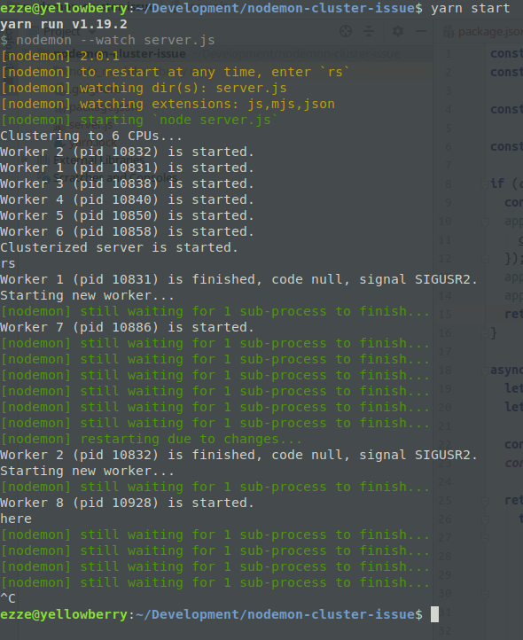

# nodemon-cluster-issue

This repo is purposed to reproduce nodemon 2.0.1 restart issue.

## How to reproduct

1. Install dependencies:

    ```bash
    $ yarn
    ```
   
2. Start clusterized Koa server with nodemon:

    ```bash
    $ yarn start
    ```
   
3. Restart nodemon by typing `rs` or make changes in `server.js`. nodemon will output

    > [nodemon] still waiting for 1 sub-process to finish...

    multiple times and will not restart.
    
    
    
